# Shop Flutter App

## Before all
- Create a firebase project.
- Add the URI to the const String api in the lib/constants/api.dart file.
- [ WARNING ]Change rules on project to:
```json
{
  "rules": {
    "orders": {
      "$uid": {
        ".write": "$uid === auth.uid",
        ".read": "$uid === auth.uid",
      },
    },
    "userProductFavorites": {
    	"$uid": {
      	".write": "$uid === auth.uid",
        ".read": "$uid === auth.uid",
      },
    },
    "products": {
        ".write": "auth != null",
        ".read": "auth != null",
    }
  }
}
```
- In Auth page, activate the E-mail/password providers

# Preview
- Implements register, login with token and logout by firebase.
- Small shop project with a Firebase backend.
- With state manager and data persistence on Firebase.

<br>

## Screens

### Login 
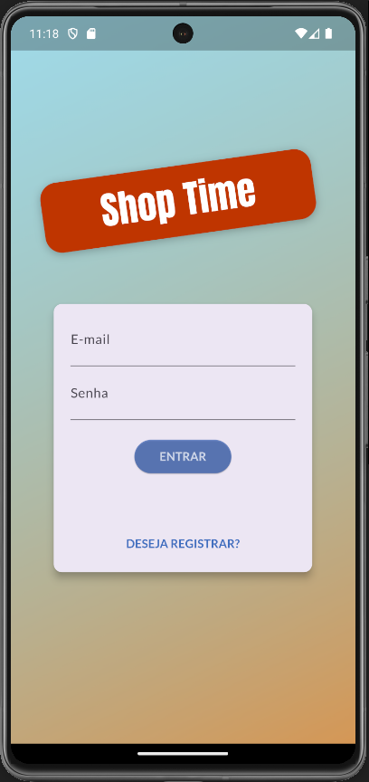

### Register 
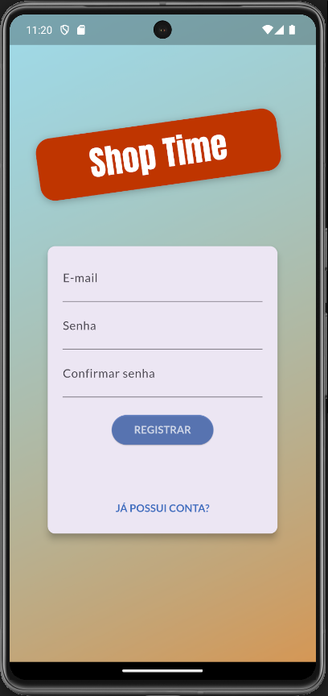

### Product Overview
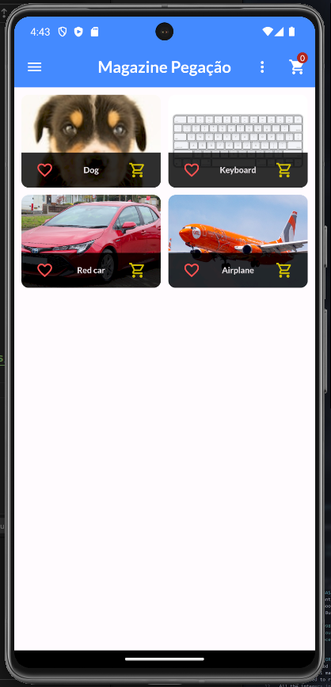

### Product Overview with favorite and cart added


### Product Overview with favorite marked
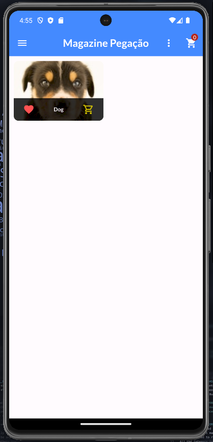

### Product Manager
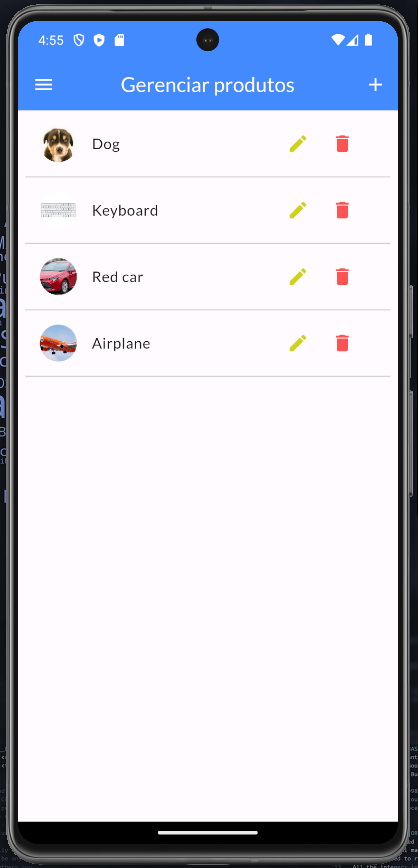

### Add Product
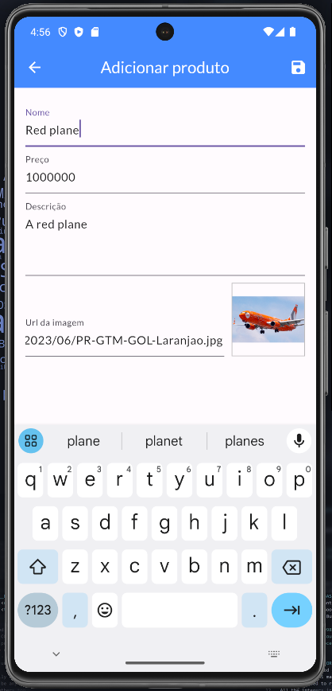


### Remove Product
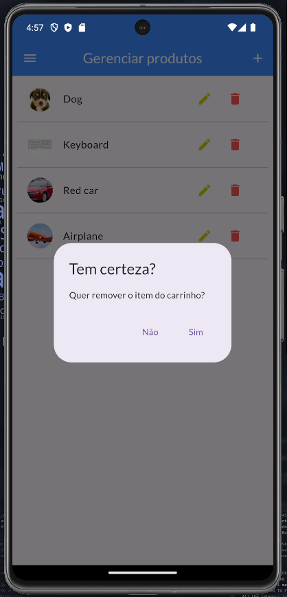


### Update Product
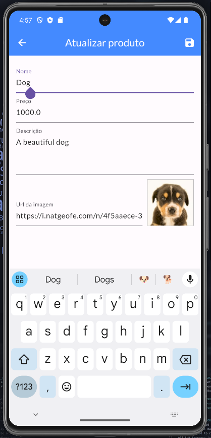

### Orders
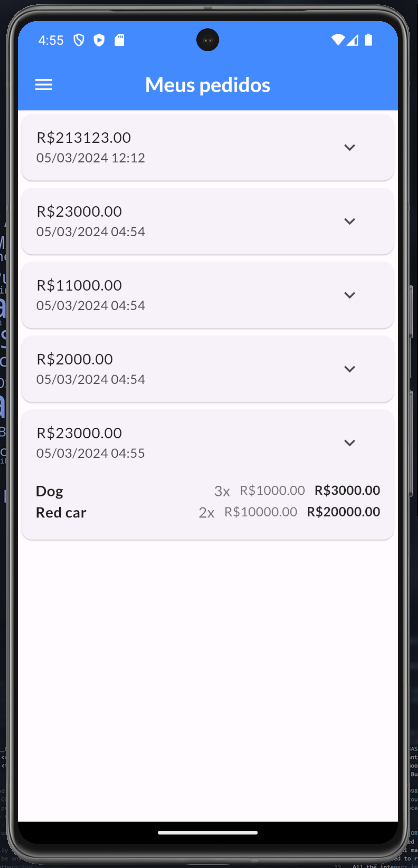


### Drawer Menu
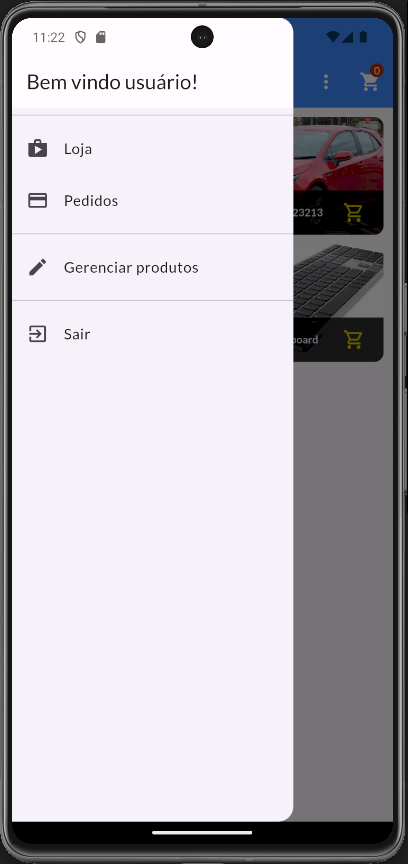

### Cart 
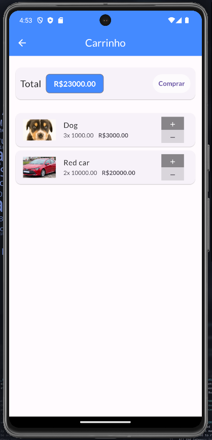


